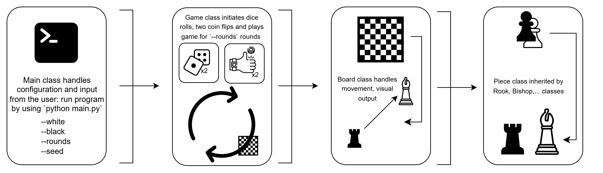
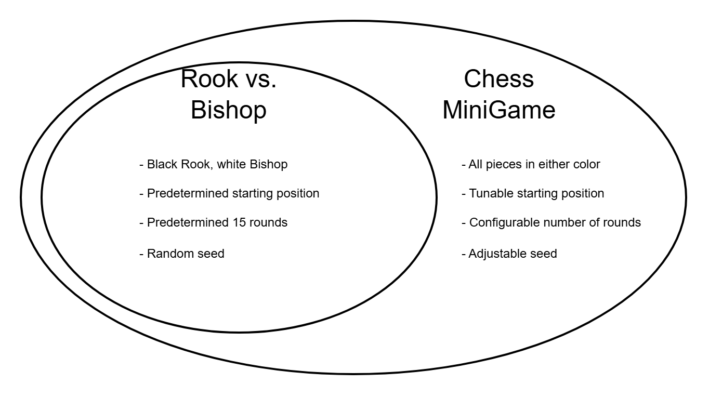

# Chess Minigame (Rook vs. Bishop Extension)

A chess survival simulation where a white piece (default = rook) tries to survive a set number (default = 15) rounds without being captured by a white piece (default = bishop).

## The Problem

The original problem is a "special" game of chess where each player only has one piece:
- **White** has a Bishop (stationary at c3)
- **Black** has a Rook (starts at h1, moving)

### Chess Minigame Update

The problem was generalized to:
- Accept starting positions of both white and black
- A random seed to ensure reproductibility
- Selection of starting chess pieces (King, Queen, Knight, Pawn)

### Game Rules

1. **Coin Toss**: Heads = black moves up, Tails = black moves right, a second coin dictates Heads = straight and Tails = diagonal movement
3. **Dice Roll**: Sum of two 6-sided dice determines the number of squares to move
4. **Board Wrapping**:
   - If the piece reaches the rightmost column, it emerges from the leftmost column
   - If the piece reaches the topmost row, it emerges from the bottommost row
   - If the piece reaches the bottommost row, it emerges from the topmost row
5. **Win Condition**:
   - Black survives 15 rounds = Black wins
   - White can capture the rook = White wins

### Chess Notation

- **Files** (columns): a-h
- **Ranks** (rows): 1-8
- **Position**: file + rank (e.g., c3, h1)

## Repository Layout

```
rook-vs-bishop/
├── src/
│   ├── main.py      # Entry point, argument parsing, game execution
│   ├── game.py      # Game logic, rounds, coin/dice mechanics
│   ├── board.py     # Board state, piece movement, display
│   └── pieces.py    # Piece classes (Position, Rook, Bishop, King, Queen, Knight, Pawn)
├── README_DEPREC.md # Original design notes
└── README.md
```

### File Usage and Implementation



<a href="https://www.flaticon.com/free-icons/board-game" title="board game icons">Board game icons created by Freepik - Flaticon</a>

<a href="https://www.flaticon.com/free-icons/pawn" title="pawn icons">Pawn icons created by rizal2109 - Flaticon</a>

<a href="https://www.flaticon.com/free-icons/rook" title="rook icons">Rook icons created by rizal2109 - Flaticon</a>

<a href="https://www.flaticon.com/free-icons/chess-piece" title="chess piece icons">Chess piece icons created by rizal2109 - Flaticon</a>

<a href="https://www.flaticon.com/free-icons/board-game" title="board-game icons">Board-game icons created by Freepik - Flaticon</a>

<a href="https://www.flaticon.com/free-icons/coin" title="coin icons">Coin icons created by Freepik - Flaticon</a>

<a href="https://www.flaticon.com/free-icons/cycle" title="cycle icons">Cycle icons created by Uniconlabs - Flaticon</a>

<a href="https://www.flaticon.com/free-icons/terminal" title="terminal icons">Terminal icons created by icon_small - Flaticon</a>

## Usage

### Basic Usage (Default: Bishop at c3, Rook at h1)

```bash
cd src
python main.py
```

### Custom Starting Positions

```bash
python main.py --white "bishop c3" --black "rook h1"
```

### Custom Rounds

```bash
python main.py --rounds 20
```

### Set Random Seed (for reproducibility)

```bash
python main.py --seed 42
```

### Full Example

```bash
python main.py --white "bishop e4" --black "rook a1" --rounds 10 --seed 123
```

### Command Line Arguments

| Argument | Default | Description |
|----------|---------|-------------|
| `--white` | `"bishop c3"` | White piece and starting position |
| `--black` | `"rook h1"` | Black piece and starting position |
| `--rounds` | `15` | Number of rounds to play |
| `--seed` | (random) | Random seed for reproducibility |

## Design Process

Development followed a phased approach, starting with the baseline Rook vs. Bishop game and progressively adding features:

### Phase 1: Baseline Rook vs. Bishop

An object-oriented approach was taken to designing the game components in the following order:

1. **Pieces** (`pieces.py`): Created `Position` class for board coordinates, base `Piece` class, and specific `Rook` and `Bishop` classes with their respective movement rules
2. **Board** (`board.py`): Implemented board state representation with capture detection logic (`can_capture`)
3. **Game** (`game.py`): Added game loop with coin toss and dice roll mechanics, round tracking, and win condition checking
4. **Main** (`main.py`): Entry point with argument parsing for seed and initial starting positions

Key observation from the original problem diagram: the Rook is black and the Bishop is white.

### Phase 2: Visual UI

Created a custom terminal UI to represent the pieces on the board:
- Experimented with different UI elements (emoji pieces, emoji checkerboards) but none aligned well in the terminal
- Settled on ANSI escape codes for colored output:
  - Checkered board pattern using alternating bracket colors (light/dark squares)
  - White pieces displayed in bright white (`\033[97m`)
  - Black pieces displayed in gray (`\033[90m`)
- Dynamic separator lines that match message lengths for consistent formatting

### Phase 3: Chess Minigame Extension

Expanded the game beyond the original Rook vs. Bishop specification:

1. **Extended Piece Support**: Added King, Queen, Knight, and Pawn classes with proper movement/capture logic
   - King: Moves one square in any direction
   - Queen: Moves horizontally, vertically, or diagonally
   - Knight: 2 and 1 square movement
   - Pawn: Captures diagonally forward (direction based on color)

2. **Multi-Axis Movement**: For pieces with combined movement types (King, Queen, Knight), implemented two coin tosses:
   - First coin: up vs right direction
   - Second coin: straight vs diagonal movement type

3. **Flexible Piece Selection**: Any piece can be assigned to white or black via command line arguments

4. **Configurable Game Parameters**: Custom starting positions, adjustable round count, reproducible games via seed

The versioning can be represented by the following diagram:



## Architecture

**Object-Oriented Design**:
- `Position`: Represents board coordinates (file, rank) with equality comparison
- `Piece`: Base class with position, color, and `move_to()` method
- `Board`: Manages piece placement, movement with wrapping, capture detection, and display
- `ChessMiniGame`: Orchestrates game flow, coin/dice mechanics, round management

**Capture Detection**:
- Each piece implements `can_capture(target_position)` based on its movement rules
- Board checks if white piece can capture black piece after each move

## Sample Output

```
**************
BISHOP VS ROOK
**************

Starting positions:
  Bishop (White): c3 (stationary)
  Rook (Black): h1 (starting position)

The Rook must survive 15 rounds to win!

=======
ROUND 1
=======
Coin toss: HEADS -> Moving up
Dice roll: 4 + 3 = 7 squares
Black position before move: h1
Black position after move: h8
   a  b  c  d  e  f  g  h
8 [ ][ ][ ][ ][ ][ ][ ][R]
7 [ ][ ][ ][ ][ ][ ][ ][ ]
6 [ ][ ][ ][ ][ ][ ][ ][ ]
5 [ ][ ][ ][ ][ ][ ][ ][ ]
4 [ ][ ][ ][ ][ ][ ][ ][ ]
3 [ ][ ][B][ ][ ][ ][ ][ ]
2 [ ][ ][ ][ ][ ][ ][ ][ ]
1 [ ][ ][ ][ ][ ][ ][ ][ ]

Black Rook is safe this round.
```

## Technical Notes

- Board uses toroidal topology (wraps around edges)
- No external packages required beyond Python standard library
- Under the understanding that no extraneous packages need to be installed

## AI Acknowledgment

AI was used in initial idea generation, syntax queries, parts of refactoring repetitive code, debugging, and README generation. This was done in consideration of an exploration vs exploitation standpoint, balancing personal learning with task performance.
